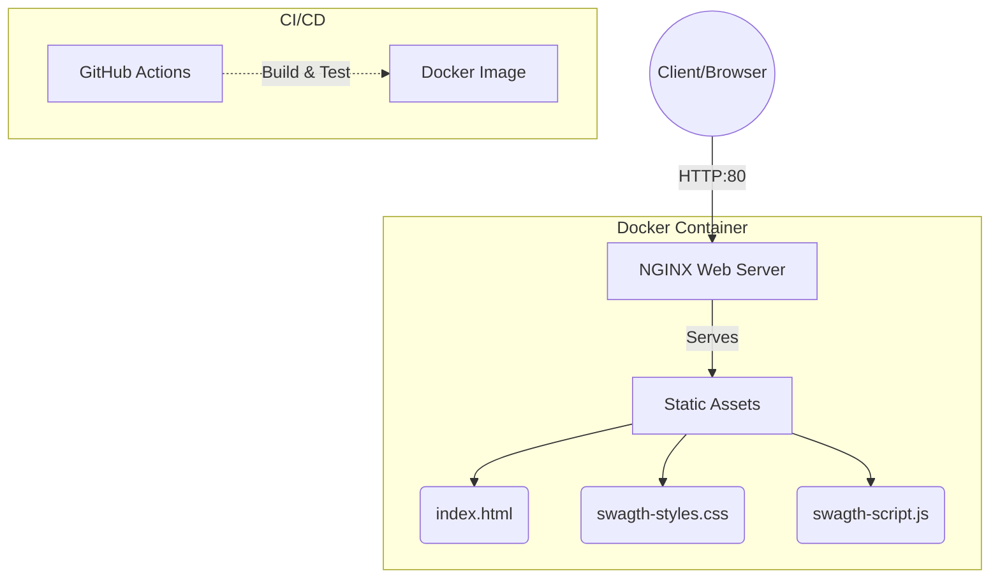

# Swagath Tech System Website

A professional, dynamic, and responsive web application built for Swagath Tech System, showcasing plumbing and electrical contract projects.

## Architecture

This project is built using a modern yet straightforward static architecture, containerized for reliable and scalable deployment. 



## Setup & Deployment

We use Docker and Docker Compose for a seamless setup experience. 

### Prerequisites

- [Docker](https://docs.docker.com/get-docker/) installed.
- [Docker Compose](https://docs.docker.com/compose/install/) installed.

### Quick Start

To run the application locally, simply execute:

```bash
docker-compose up -d --build
```

The application will be accessible at [http://localhost:8080](http://localhost:8080).

### Stopping the Server

To stop the running application:

```bash
docker-compose down
```

## Dependency Rationale

- **NGINX (alpine)**: Used as the core web server to serve static content. It is extremely lightweight, performant, and secure. The `alpine` variant is chosen to keep the final image size minimal, reducing the attack surface and improving deployment times.
- **Docker & Docker Compose**: Used to containerize the application to ensure that it runs consistently regardless of the host environment, preventing "it works on my machine" issues.
- **GitHub Actions**: Configured to run an automated CI pipeline on push and pull requests to main branches, guaranteeing that every change passes a baseline sanity check before deployment.
- **Vanilla HTML/CSS/JS**: Opted for vanilla technologies to remove complex build chains and unnecessary abstractions, resulting in faster load times and an easily maintainable codebase.