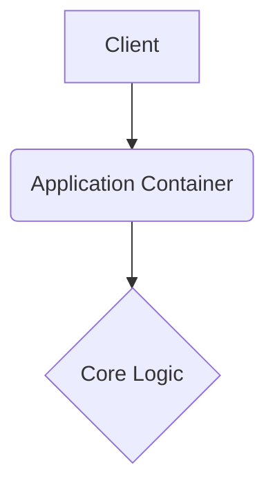

# swagath-tech-system-website

This repository is built with strict enterprise engineering standards, focusing on resilient architecture, graceful error handling, and robust continuous integration.

## 🏗️ System Architecture



## 🚀 Setup Instructions

```bash
docker-compose up --build -d
```

## 📂 Structure

Following standard design patterns for a predictable layout.

---

## Original Readme

# 🏗️ SWAGATH TECH SYSTEM - Official Website

**Professional Plumbing & Electrical Contract Projects Website**

## 🌟 **About**

SWAGATH TECH SYSTEM is a leading plumbing and electrical contracting company in Karnataka, established in 2015. We specialize in providing comprehensive MEP (Mechanical, Electrical, and Plumbing) solutions for residential, commercial, and industrial projects.

## 🚀 **Features**

- **Responsive Design**: Mobile-first approach with modern UI/UX
- **Dynamic Backgrounds**: Rotating project images and themed backgrounds
- **Interactive Portfolio**: Showcase of commercial, residential, and resort projects
- **Professional Services**: Plumbing, electrical, and contract project management
- **Contact Forms**: Easy communication with integrated WhatsApp integration
- **SEO Optimized**: Clean code structure for better search engine visibility

## 🛠️ **Technologies Used**

- **Frontend**: HTML5, CSS3, JavaScript (ES6+)
- **Styling**: Custom CSS with animations and responsive design
- **Icons**: Font Awesome 6.0
- **Fonts**: Google Fonts (Inter)
- **Hosting**: GitHub Pages ready

## 📁 **Project Structure**

```
swagath-tech-system/
├── index.html          # Main website file
├── swagth-styles.css   # Custom styling
├── swagth-script.js    # Interactive functionality
├── README.md           # Project documentation
└── .gitignore          # Git ignore rules
```

## 🎯 **Key Sections**

1. **Hero Section**: Dynamic backgrounds with company branding
2. **Services**: Plumbing, electrical, and contract services
3. **Why Choose Us**: Company features and benefits
4. **Portfolio**: Project showcase by category
5. **Projects**: Detailed project information
6. **About Us**: Company history and founder details
7. **Contact**: Contact information and inquiry forms

## 🚀 **Getting Started**

### **Local Development**
1. Clone the repository
2. Open `index.html` in your browser
3. Or use a local server: `python3 -m http.server 8000`

### **Deploy to GitHub Pages**
1. Push to GitHub
2. Enable GitHub Pages in repository settings
3. Select source branch (main/master)
4. Your site will be available at: `https://username.github.io/repository-name`

## 📱 **Responsive Design**

- **Desktop**: Full-featured experience with all animations
- **Tablet**: Optimized layout for medium screens
- **Mobile**: Mobile-first design with touch-friendly interactions

## 🌐 **Live Demo**

Visit the live website: [Your GitHub Pages URL will appear here]

## 📞 **Contact Information**

- **Phone**: +91 9731851615
- **Email**: jogip317@gmail.com
- **Address**: Navagrams Benjanapoadu, Bantwal Taluk, Karnataka State
- **WhatsApp**: [Direct WhatsApp Link]

## 📄 **License**

This project is proprietary to SWAGATH TECH SYSTEM. All rights reserved.

## 🤝 **Partnership**

Official plumbing and electrical contractor for ANUV Engineers, showcasing high-quality projects across Karnataka.

---

**Built with ❤️ by SWAGATH TECH SYSTEM Team** 